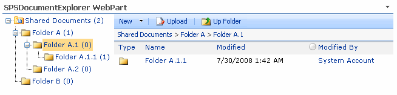

# SPSProfessional Complete Repo

**SPSProfessional**

This is the SPSProfessional full repo of solutions

- SPSMailToList WebPart v1.5
..- Outlook AddIn
- Navigation Web Parts v2.8
..- Folder BreadCrumb
..- Folder Explorer
..- Web Explorer
..- Folder Explorer Feature
- SPSExplorer WebParts v2.9
- Cut Copy / Paste v2.8c
- SPSRollUp WebPart v3.1
..- SPSRollUpCalendar
..- SPSRollUpTree
..- SPSTagging soon!!
- SPSRollUpChart WebPart v3.1
- SPSSite Creation Event v1.8
- ActionDataBase

Released new versions – Using our new framework 2.8 - New MailToList WebPart
Cut Copy Paste Feature - Version 2.8b

## Cut, Copy and Paste

One useful and important functionality missing in SharePoint Libraries is the possibility to cut/copy documents and folders from one Document Library to another or from one Folder to another.

The SPSProfessional Cut Copy&Paste Feature fills this gap to complement the default functionality. It allows Cut Copy&Paste management for documents and folders in the same or in a different Document Library and Site.

## Navigation WebParts - Version 2.8

Navigation WebParts

A complete set of WebParts to put users in control. This package contains four webparts and a feature to help you obtain a better navigation and improved user experience.

* FolderBreadCrumb WebPart
* FolderExplorer WebPart
* WebExplorer WebPart
* Folder Explorer Feature
* Site Collection Explorer

## SPSRollUp WebPart - Version 3.1

With SPSRollUp you can aggregate incoming content from various lists. To do this you only have to specify the site from which you want to crawl data, your wish lists and the fields’ names

This new release add two new webparts which aggregate data in a calendar view or in a tree view.

## SPSRollUp Chart WebPart - Version 3.1

With SPSRollUpChart you can transform your aggregate data into good-looking charts.

Line, Bar 2D, Area 2D, Column 2D, Column 3D, Pie 2D, Pie 3D, Multi Series Column 3D, Multi Series Column 3D Line DY and Stacked Column 3D

## SPSExplorer WebParts - Version 2.8

Two new webparts to enhance navigation across lists and documents libraries.

This webpart adds a tree folder view, a breadcrumb navigation and a customized toolbar to any list view or document library view. Read more...

## ActionDataBase WebParts

ActionDataBase is a set of webparts to connect quickly and effortlessly with your Back-End DataBase, as an alternative to Business Data Catalog. DEMO Video EDIT YOUR DATABASE FROM INSIDE SHAREPOINT IN 4 MINUTES

The ActionGrid WebPart displays data from a SQL Server DataBase. With a "select command", the results are presented on screen.

Connect the ActionGrid WebPart with the ActionEditor WebPart and take full control to create, edit, update and delete your SQL data. 

## Site Creation Event Handler - Version 1.8

One of the features that has been most requested by our customers has been the possibility of creating sub-sites that are automatically linked to a list so that when you create an item in the list a specific web site is created which uses a specified template and includes the possibility of selecting certain permissions for the new site.

In this way you can quickly create sites in a semi-automatic manner, which allows for easier management of your site structure. 

#  SPS ActionDataBase WebParts

ActionDataBase is a set of Web parts to connect quickly and effortlessly with your Back-End DataBase, as alternative to Business Data Catalog. The ActionGrid WebPart displays data from a Database: with a simple "select command", the configuration of columns, headers and formats as presented on screen. The ActionGrid also connects with other Webparts to create Master-Detail grids or connect with a form WebPart to filter data.

**ActionGrid Features:**

-   Custom context menus
-   Sortable and Pageable grids
-   Provider and Consumer interfaces
-   Show your database data in less than 4 minutes
-   Include a Windows application to configurate
-   MOSS and WSS support

Connect the ActionGrid WebPart with the ActionEditor WebPart and take full control to create, edit, update and delete data.

**ActionEditor Features:**

-   Full editing control
-   Fully customizable Tool Bar
-   Lookup fields, DropDownList
-   Error Management
-   Date and DateTime fields controls (as SharePoint)
-   Fields validations (Required, Range, Regular Expression, Comparison)
-   Rich Text format fields (as SharePoint)
-   Include a Windows application to configure
-   MOSS and WSS support

# SPSProfessional Cut Copy & Paste Feature

The SPSProfessional Cut Copy & Paste Feature adds the possibility to cut/copy documents and folders from one Document Library to another to complement the default functionality.

# SPSRollUp WebParts

With SPSRollUp you can aggregate incoming content from various lists. To do this you only have to specify the site from which you want to crawl data, your wish lists and the fields’ names.

**Package include SPSRollUpCalendar & SPSRollUpTree.**

**SPSRollUpCalendar** has a similar operation to the SPSRollUp and SPSRollUpChart, and this means that it tracks sites and lists collecting information, the collected data is transformed using XSLT to generate XML as SPSRollUpChart does. The result XML is a description of the events to show in a calendar view.

**SPSRollUpTree** has a similar operation to the SPSRollUp, and this means that it tracks sites and lists collecting information, but in this case the data use a XML Tree configuration to output the data using a tree view control. The XML configuration define the tree branches and the leaf node. Finally when a leaf node is clicked if the SPSRollUpTree is connected to another webpart it send the selected row of data.

# SPSExplorer WebParts

SPSExplorer WebParts are two webparts designed to improve the SharePoint user experience when navigating across Document Libraries or Lists that include folders.

These webparts shows, a folder tree view, a breadcrumb navigation bar and a toolbar with optional buttons. You only needs select the list or document library and the list view that you want show.

**SPSListExplorer**  is designed to use with lists and  **SPSDocumentExplorer**  with Document Libraries.

# SPSProfessional Navigation WebParts

The SPSProfessional Navigation Web Parts ensure maximum ease and efficiency in working with the SharePoint platform by enabling users to view and navigate rapidly across the entire Web or Site structure, navigate using breadcrumbs, navigate seamlessly to the desired folder.

The Navigation WebParts package includes:

-   **FolderBreadCrumb**, a breadcrumb navigator to be used in conjunction with the List Viewer webpart (that is automatically generated by SharePoint for each List and Document Library). This component provides a smooth, effortless navigation experience.
-   **FolderExplorer**, generates a tree with the folder structure of any list or Document Library. Use this web part in conjunction with the List Viewer webpart to navigate seamlessly to the desired folder.
-   **WebExplorer**, creates a tree with the web structure, enabling users to view and navigate rapidly across the entire Web or Site structure.
-   **FolderExplorer Feature**, a SharePoint Feature that adds a new button in the actions toolbar of Document Libraries to show a folder explorer navigation page.

# SPSMailToList WebPart

SPSMailToList is designed to fetch the content of a POP3 mail account into a SharePoint List. After deploy the solution you has a new feature that you can activate in any web site, this feature add a new list template in your web, to store the mails.  

When the feature is activated you should have a new list template called “SPSProfessional Mail to List”, in order to store the mails you need create a new list based in this template.  
  
To retrieve the POP3 mail you need add a web part in your page, the webpart is called “SPSMailToList”, in the properties you should fill the name, password, pop3 mail server, and the list where the messages are stored.  
  
**Properties:**

-   Login: the pop3 user login account
-   Password: the pop3 password
-   Mail Server: the server address
-   Mail Port: port used by the server, default is 110
-   Use SSL: check if your pop3 server require an SSL connection
-   List to store Messages: The list based in the Mail template used to store the mail
-   Get Mail Manually: If checked the button to fetch mail is displayed if unchecked the webpart should fetch the mail on each load.

The webpart has only a button that is used to get mail. When pressed the mail is retrieved from the pop3 server and are stored in the specified list. MIME and RTF text format is conserved and the attachment remains as list attachments. You can configure alerts in the list in order to communicate to the users’ new mails and so on.

# SPSProfessional Site Creation

SPSProfessional Site Creation / Provisioning is a solution that will allow you to create sites in a semi-automatic mode with sub-sites automatically linked to a list, so that when you create an item in a list a certain Web site is created, with a specific template and the possibility of being able to select certain permissions for the new site.

The solution is being implemented as a feature that can be displayed on any Web. This feature will allow you to add the event any web site where it has been activated. Once this feature is activated you will find a new option in the site configuration (Site Settings) under the Management site heading (Site Administration)

Through this option you can manage the lists to which you want to link this event. The main screen will show you a toolbar which links the event to. The main screen will show us a toolbar to link the event to a new list and below this the list of names that currently have the creation events sites activated. By clicking on "Attach new list" you will access a screen where you can select the list to which you want to link the event.

The list requires at least:

- A text field where the list user will specify the name of the new site  
- A hyperlink field where we will store the new created site Url  
- A choice field to allow us to choose the templates.

Each of the necessary fields has been identified. When there is more than one text field where you can enter the name of the new site, you can select the one you would prefer to use.

You can determine the permissions of the new site by the following interface. You can establish whether the new site will inherit the permissions from the current site (default option) you want to establish new permissions (selecting the unique permissions box)

Finally you can establish whether the created site is deleted when the item is deleted from the list.

